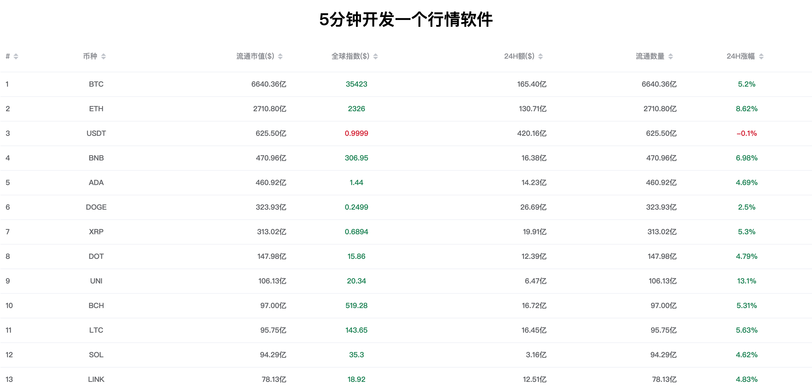

鉴于之前 ccxt 的接口貌似被墙了。

国内访问不了。

所以我又重新用了 非小号 的数据 重新弄了一下，现在国内的也能访问了。

非小号的 api 禁止了浏览器跨域请求。所以中间我又用我的服务器做了一层 nginx 反向代理转发接口的数据。

> 技术栈： html css js vue elementUI axios

流程：

1. 行情系统无非就是一张动态数据的表格。
2. 只要获取到数据，然后按照一定的方式展示就行了。

### 软件截图：



展示：
> - 想直接查看效果 [请点击这里](https://liuzemei.github.io/ticker/index.html)
> - 也欢迎 [start](https://github.com/liuzemei/ticker)
> - 加了一些字体和颜色，所以比上一版的要稍微好看一点...


```html
<!DOCTYPE html><!DOCTYPE html>
<html lang="en">

<head>
  <meta charset="UTF-8">
  <meta name="viewport" content="width=device-width, initial-scale=1.0">
  <meta http-equiv="X-UA-Compatible" content="ie=edge">
  <title>5分钟开发一个行情软件</title>
  <script src="https://cdn.jsdelivr.net/npm/vue/dist/vue.js"></script>
  <link rel="stylesheet" href="https://unpkg.com/element-ui/lib/theme-chalk/index.css">
  <script src="https://cdn.bootcdn.net/ajax/libs/axios/0.21.1/axios.js"></script>
  <script src="https://unpkg.com/element-ui/lib/index.js"></script>
  <style>
      html {
          font-family: Roboto-medium, Roboto, PingFangSC-Medium, Microsoft YaHei;
      }

      .blue {
          color: #008555;
      }

      .red {
          color: #d60f2a;
      }
  </style>
</head>

<body>
<div id="app" v-loading="loading">
  <h1 style="text-align: center">5分钟开发一个行情软件</h1>
  <el-table :data="tableData" style="width: 100%">
    <el-table-column prop="rank" width="60" label="#" sortable></el-table-column>
    <el-table-column prop="symbol" label="币种" align="center" sortable></el-table-column>
    <el-table-column prop="market_cap_usd" label="流通市值($)" align="right" sortable>
      <template slot-scope="scope">{{scope.row.market_cap_usd | handleBigNumber}}</template>
    </el-table-column>
    <el-table-column prop="price_usd" label="全球指数($)" align="center" sortable>
      <template slot-scope="scope">
        <span :class="scope.row.percent_change_1h > 0 ? 'blue' : 'red'">{{scope.row.price_usd}}</span>
      </template>
    </el-table-column>
    <el-table-column prop="volume_24h_usd" label="24H额($)" align="right" sortable>
      <template slot-scope="scope">{{scope.row.volume_24h_usd | handleBigNumber}}</template>
    </el-table-column>
    <el-table-column prop="market_cap_usd" label="流通数量" align="right" sortable>
      <template slot-scope="scope">{{scope.row.market_cap_usd | handleBigNumber}}</template>
    </el-table-column>
    <el-table-column prop="percent_change_24h" label="24H涨幅" align="center" sortable>
      <template slot-scope="scope">
        <span :class="scope.row.percent_change_24h > 0 ? 'blue' : 'red'">{{scope.row.percent_change_24h + '%'}}</span>
      </template>
    </el-table-column>
  </el-table>
</div>
<script>
  var app = new Vue({ // Vue实例 动态绑定数据
    el: '#app',
    data() {
      return {
        tableData: [],
        timer: null,
        loading: false
      }
    },
    mounted() {
      updateDataTimer.call(this);
    },
    filters: {
      handleBigNumber(usd) {
        if (usd > 1e12) return (usd / 1e12).toFixed(2) + '万亿'
        if (usd > 1e8) return (usd / 1e8).toFixed(2) + '亿'
        if (usd > 1e4) return (usd / 1e4).toFixed(2) + '万'
        return usd
      }
    },
    destroyed() {
      clearInterval(this.timer);
      this.timer = null;
    }
  });

  function updateDataTimer() {  // 设计一个定时器，不停的去更新数据
    getExchangeInfo.call(this);
  }

  async function getExchangeInfo() { // 获取交易所的数据
    if (this.tableData.length === 0) this.loading = true
    try {
      const { data } = await axios.get(`https://ticker.liuzemei.com/`)
      this.tableData = data
      if (this.loading) this.loading = false
    } catch (e) {
      this.$message.error('加载失败...正在重试...')
      return getExchangeInfo.call(this)
    }
    this.timer = setTimeout(getExchangeInfo.bind(this), 60 * 1000)
  }
</script>
</body>
</html>
```
